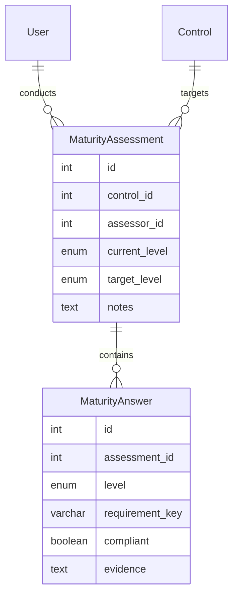

# Data Model Overview

The scaffold application consolidates entity models from the legacy `bia_app` and `csa_app` projects.

## Identity

- `User`: unified account record with status workflow, optional username, and theme preference.
- `Role`: reusable authorisation roles linked many-to-many with users.
- `MFASetting`: stores TOTP secrets, enrolment timestamps, and verification metadata.

## BIA Domain

- `ContextScope`: top-level BIA context with ownership metadata and change tracking.
- `Component`: assets linked to a context; connects to consequences and availability targets.
- `Consequences`: CIA impact definitions with helper methods for category parsing.
- `AvailabilityRequirements`: RTO/RPO/MTD/MASL metrics per component.
- `AIIdentificatie`: AI risk classification enumerations.
- `Summary`: single summary per context scope.

## CSA Domain

- `Control`: control catalogue entry (ISO 27002 etc.).
- `AssessmentTemplate`: question-set JSON for controls with versioning.
- `Assessment`: lifecycle of a self-assessment including ratings and comments.
- `AssessmentAssignment`: many-to-many assignments between assessments and users.
- `AssessmentResponse`: answers and evidence per dimension.
- `AuditTrail`: compliance-grade activity log.
- `AuditLog`: central audit stream capturing admin and system events with actor metadata.
  - Automatic SQLAlchemy listeners record create/update/delete events for configured models (defaults include `User` and `Role`). Override `AUDIT_LOG_MODEL_EVENTS` to adjust tracked fields per model.

## Risk Domain

- `Risk`: captures title, description, discovery date, impact/chance enums, treatment strategy, and (when mitigating) one or more CSA `Control` references stored in the `risk_control_links` join table. Risks also link to one or more BIA `Component` records via `risk_component_links` and expose helper methods that translate the weighted score to a configured severity.
- `RiskImpactAreaLink`: stores the selected business impact areas (Operational, Financial, Regulatory, Human & Safety, Privacy) per risk with uniqueness enforced per pair.
- `RiskSeverityThreshold`: administrator-managed ranges that map numeric scores to severities (`low`, `moderate`, `high`, `critical`). Defaults seed values that cover the 1-25 score space but can be adjusted without code changes.
- Admin panel routes under `/admin/risks` provide CRUD management for risks, while `/admin/risk-thresholds` lets privileged users update the severity ranges without touching migrations.

## Maturity Domain

- `MaturityAssessment`: links a standard CSA `Control` to a CMMI maturity level (1-5) assessed by a `User`. Stores the calculated current level and target level.
- `MaturityAnswer`: captures the compliance status (`compliant`/`non-compliant`) and evidence for specific CMMI requirements within an assessment.
- `MaturityLevel`: an IntEnum defining the 5 CMMI levels (Initial, Managed, Defined, Quantitatively Managed, Optimizing).

## Metadata

- All models share the same SQLAlchemy metadata and are exposed via `scaffold.models` for Alembic autogeneration.
- Table names use domain prefixes (`bia_`, `csa_`) to avoid collisions and to make ownership explicit.
- Timestamp columns use timezone-aware UTC defaults through the shared mixin.

## Migration Notes

- Rename legacy BIA tables (`context_scope`, `component`, `consequences`, etc.) to their new `bia_`-prefixed variants or create views for temporary compatibility.
- Consolidate the legacy BIA/CSA user tables into the shared `users` model, including MFA secrets and activation flags.
- Populate `ContextScope.author_id` with historical ownership data sourced from the former `user_id` column before removing it.
- CSA enums (`csa_assessment_status`, `csa_assessment_result`, `csa_assessment_dimension`) must exist prior to autogeneration; keep enum names stable to avoid PostgreSQL recreation issues.

### Backward Compatibility

- Password hashes remain Werkzeug-compatible; no re-hash required.
- Replace the BIA string `role` column by seeding roles in the `roles` table and associating users via the `user_roles` link.
- Migrate MFA secrets into `mfa_settings` to prevent forced re-enrolment.
- Update downstream reporting that referenced unprefixed table names.

## Next Actions

1. Reconcile legacy Alembic history into unified revisions.
2. Implement data-migration scripts for BIA roles and CSA MFA settings.
3. Add model-level tests covering key relationships and event listeners.
