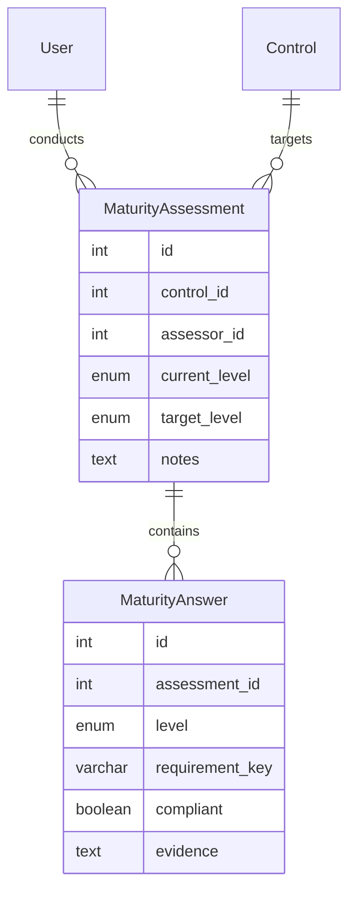

# Data Model Overview

The scaffold application consolidates entity models from the legacy `bia_app` and `csa_app` projects.

## Identity

- `User`: unified account record with status workflow, optional username, and theme preference.
- `Role`: reusable authorisation roles linked many-to-many with users.
- `MFASetting`: stores TOTP secrets, enrolment timestamps, and verification metadata.

## BIA Domain

- `ContextScope`: top-level BIA context with ownership metadata and change tracking.
- `BiaTier`: classification levels (0-4) for context criticality (e.g. Critical Infrastructure -> Deferrable) with localized labels.
- `Component`: assets linked to a context; connects to consequences and availability targets.
- `Consequences`: CIA impact definitions with helper methods for category parsing.
- `AvailabilityRequirements`: RTO/RPO/MTD/MASL metrics per component.
- `AIIdentificatie`: AI risk classification enumerations.
- `Summary`: single summary per context scope.

## CSA Domain

- `Control`: control catalogue entry (ISO 27002 etc.).
- `AssessmentTemplate`: question-set JSON for controls with versioning.
- `Assessment`: lifecycle of a self-assessment including ratings and comments.
- `AssessmentAssignment`: many-to-many assignments between assessments and users.
- `AssessmentResponse`: answers and evidence per dimension.
- `AuditTrail`: compliance-grade activity log.
- `AuditLog`: central audit stream capturing admin and system events with actor metadata.
  - Automatic SQLAlchemy listeners record create/update/delete events for configured models (defaults include `User` and `Role`). Override `AUDIT_LOG_MODEL_EVENTS` to adjust tracked fields per model.

## Risk Domain

- `Risk`: captures title, description, discovery date, impact/chance enums, treatment strategy, and (when mitigating) one or more CSA `Control` references stored in the `risk_control_links` join table. Risks also link to one or more BIA `Component` records via `risk_component_links` and expose helper methods that translate the weighted score to a configured severity.
- `RiskImpactAreaLink`: stores the selected business impact areas (Operational, Financial, Regulatory, Human & Safety, Privacy) per risk with uniqueness enforced per pair.
- `RiskSeverityThreshold`: administrator-managed ranges that map numeric scores to severities (`low`, `moderate`, `high`, `critical`). Defaults seed values that cover the 1-25 score space but can be adjusted without code changes.
- Admin panel routes under `/admin/risks` provide CRUD management for risks, while `/admin/risk-thresholds` lets privileged users update the severity ranges without touching migrations.

## Maturity Domain

- `MaturityAssessment`: links a standard CSA `Control` to a CMMI maturity level (1-5) assessed by a `User`. Stores the calculated current level and target level.
- `MaturityAnswer`: captures the compliance status (`compliant`/`non-compliant`) and evidence for specific CMMI requirements within an assessment.
- `MaturityLevel`: an IntEnum defining the 5 CMMI levels (Initial, Managed, Defined, Quantitatively Managed, Optimizing).

## Threat Modeling Domain

- `ThreatModel`: top-level container for a threat model, scoped with a title, description, scope narrative, and optional owner. Supports archiving. Now carries a `methodology` field (`STRIDE`, `PASTA`, `LINDDUN`, `OWASP`) and an optional `bootstrap_source_model_id` for one-way traceability when a PASTA model is created from an existing STRIDE model.
- `ThreatModelAsset`: assets within a model (components, data flows, trust boundaries, external entities, data stores), ordered by position.
- `ThreatScenario`: core record per identified threat. Captures STRIDE-LM category, likelihood (1-5), impact (1-5), computed risk score and level (`low`/`medium`/`high`/`critical`), treatment option (`accept`/`mitigate`/`transfer`/`avoid`), residual risk breakdown (likelihood, impact, score, level), affected CIA aspects, lifecycle status (`identified` → `analysed` → `mitigated` → `accepted` → `closed`), and optional links to BIA `Component` records and CSA `Control` entries via the `threat_scenario_controls` join table.
- `threat_scenario_controls`: many-to-many join between `ThreatScenario` and CSA `Control`.

### PASTA Workflow Models

PASTA threat models have a model-level workflow with seven ordered stages. These records are separate from existing STRIDE-LM per-scenario fields, which remain untouched.

- `PastaStageRecord`: one row per PASTA stage per model (seven total). Tracks `stage_code`, `display_order`, `status` (`available` / `locked` / `completed` / `needs_revalidation`), `summary`, `completion_notes`, and a `completed_at` / `completed_by` audit trail.
- `PastaFinding`: a reviewable finding captured within one PASTA stage. Carries `finding_type` (`objective`, `scope_item`, `decomposition_item`, `threat`, `vulnerability`, `attack_path`, `risk_conclusion`), `title`, `description`, `evidence`, `priority`, and `status` (`current` / `needs_revalidation` / `archived`). Threat-oriented findings (`THREAT`, `VULNERABILITY`, `ATTACK_PATH`) can generate or link standard `ThreatScenario` records.
- `PastaFindingAssetLink`: link from a finding to one of the model's `ThreatModelAsset` records.
- `PastaFindingStrideCategoryLink`: optional STRIDE-LM category annotation on a finding (finding can have zero or many STRIDE categories).
- `PastaFindingThreatScenarioLink`: traceability link from a PASTA finding to a generated or manually linked `ThreatScenario`, with a `link_type` field (`generated` / `linked`).
- `PastaRiskConclusion`: one-to-one with a `risk_conclusion` type `PastaFinding`. Stores structured stage-seven scoring: `likelihood_score`, `impact_score`, `overall_score` (derived via `compute_pasta_overall_score`), `treatment` strategy, `publication_state` (`not_published` / `published` / `needs_revalidation`), `published_risk_id` (nullable FK → `risk_items.id`), `last_published_at`, `last_published_by_id`, and `publication_notes`. `is_publishable` checks that all scores are present, a narrative description exists, and neither the finding nor stage-7 is in `needs_revalidation` state. `blocked_reasons` returns a list of i18n keys. Table: `pasta_risk_conclusions`.

Risk scoring follows `likelihood × impact_score`; `RiskLevel` thresholds are hardcoded (`low ≤ 4`, `medium ≤ 9`, `high ≤ 14`, `critical ≥ 15`). The `services.py` module exposes `apply_risk_score` and `apply_residual_risk_score` helpers, plus `export_scenarios_csv` (STRIDE) and `export_pasta_findings_csv_with_scores` (PASTA, includes score columns), `bootstrap_pasta_from_stride`, `initialize_pasta_stages`, `evaluate_stage_progression`, `trigger_revalidation_for_stage`, `compute_pasta_overall_score`, `apply_pasta_conclusion_scores`, and `publish_pasta_conclusion_to_risk`.

### Threat Model Migrations

- `20260317_0001_add_threat_modeling_module`: creates `threat_models`, `threat_model_assets`, `threat_scenarios`, and `threat_scenario_controls`.
- `20260317_0002_threat_scenario_residual_risk_breakdown`: replaces the single `residual_risk` text column with structured `residual_likelihood`, `residual_impact`, `residual_risk_score`, and `residual_risk_level` columns.
- `20260608_0001_pasta_threat_modeling`: adds `methodology` and `bootstrap_source_model_id` to `threat_models`; creates `pasta_stage_records`, `pasta_findings`, `pasta_finding_asset_links`, `pasta_finding_stride_links`, and `pasta_finding_scenario_links`.
- `20260608_0002_pasta_risk_conclusions`: creates `pasta_risk_conclusions`; backfills existing stage-seven `risk_conclusion` findings as `not_published` draft records.

```mermaid
erDiagram
    User ||--o{ MaturityAssessment : conducts
    Control ||--o{ MaturityAssessment : targets
    MaturityAssessment ||--o{ MaturityAnswer : contains

    MaturityAssessment {
        int id
        int control_id
        int assessor_id
        enum current_level
        enum target_level
        text notes
    }

    MaturityAnswer {
        int id
        int assessment_id
        enum level
        varchar requirement_key
        boolean compliant
        text evidence
    }
```

## Metadata

- All models share the same SQLAlchemy metadata and are exposed via `scaffold.models` for Alembic autogeneration.
- Table names use domain prefixes (`bia_`, `csa_`) to avoid collisions and to make ownership explicit.
- Timestamp columns use timezone-aware UTC defaults through the shared mixin.

## Migration Notes

- Rename legacy BIA tables (`context_scope`, `component`, `consequences`, etc.) to their new `bia_`-prefixed variants or create views for temporary compatibility.
- Consolidate the legacy BIA/CSA user tables into the shared `users` model, including MFA secrets and activation flags.
- Populate `ContextScope.author_id` with historical ownership data sourced from the former `user_id` column before removing it.
- CSA enums (`csa_assessment_status`, `csa_assessment_result`, `csa_assessment_dimension`) must exist prior to autogeneration; keep enum names stable to avoid PostgreSQL recreation issues.

### Backward Compatibility

- Password hashes remain Werkzeug-compatible; no re-hash required.
- Replace the BIA string `role` column by seeding roles in the `roles` table and associating users via the `user_roles` link.
- Migrate MFA secrets into `mfa_settings` to prevent forced re-enrolment.
- Update downstream reporting that referenced unprefixed table names.

## Next Actions

1. ~~Reconcile legacy Alembic history into unified revisions.~~ ✓ Complete.
2. ~~Implement data-migration scripts for BIA roles and CSA MFA settings.~~ ✓ Complete.
3. Add model-level tests covering key relationships and event listeners.
